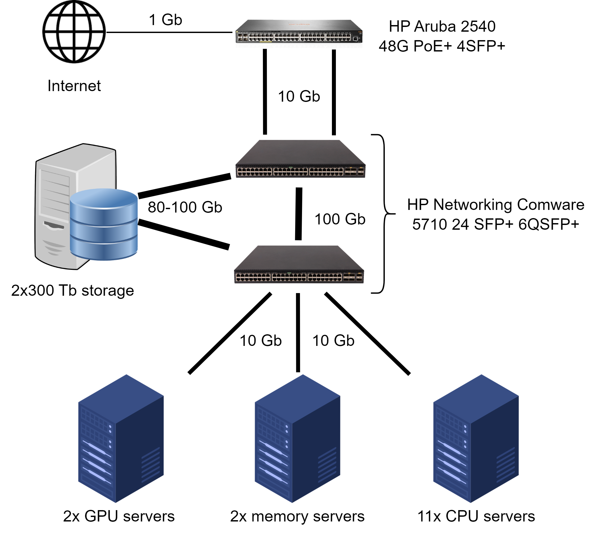

# Using the Scientific Computing cluster

The Scientific Computing cluster is the 17 server's supercomputer currently hosted at the Inkubator House of HCEMM, and is managed by the [Scientific Computing ACF](https://acf.hcemm.eu/acf/scientific-computing/).

<p align="center">
  
</p>
<p align="center">Physical diagram of the SC cluster.</p>

On the 1st of February 2025, the SC cluster came online. This tutorial will guide you through the steps to access and use it.

## Obtaining credentials and logging into the cluster

Employees of HCEMM are required to fill out the [provided form](https://docs.google.com/forms/d/e/1FAIpQLSdYtCZQcaFNFLVI64hxWyigVz31GuoSrcqIz3n_kalXVCFxlA/viewform?usp=pp_url&entry.598441848=1&entry.760391226=256+Gb&entry.175258676=No&entry.1787069197=I+will+be+performing+the+following+computational+tasks:+%0A-+e.g.,+MS/MS,+microbiomes,+RNA-Seq%0A-+e.g.,+MD+modelling,+DL+model+creation+and+prediction%0A%0AI+want+to+solve+the+research+question:+%0A-+e.g.,+Identify+differentially+expressed+genes+in+cancer+samples%0A%0AI+need+the+following+specific+packages/software:+%0A-+e.g.,+Python+3.8,+TensorFlow,+R+with+DESeq2%0A%0AI+have+the+following+additional+requirements:+%0A-+e.g.,+Custom+Python+library,+specific+version+of+a+tool,+large+temporary+storage%0A%0A(please+remove+the+non-relevant+sections)&entry.1260858631=No&entry.1316491120=No) with information regarding the bioinformatic works that are intended to be run on the cluster.

After getting the credentials by e-mail, running `ssh username@cluster.hcemm.eu` will prompt for a password, and after inserting the password, access is granted to the login node. From here, jobs can be submitted to the cluster.

## Slurm Workload Manager

The bioinformatic jobs submitted to the SC cluster are managed by [Slurm](https://slurm.schedmd.com/documentation.html). To learn more about how you can format your jobs to be submitted to the cluster, refer to the [tutorial](tutorials/slurm_tutorial) on Slurm.

## Useful recipes for Apptainer

[Apptainer](https://apptainer.org/), the successor to Singularity, is used to provide containerized environments on the SC cluster. This is an alternative way to run analysis on the cluster, and allows to run commands with privileges that are not available on the cluster itself as, for example, `dnf/deb/apt install`.

To build an Apptainer container, you can follow these steps:

1. Get a container from the `lolcow` image: `apptainer pull library://godlovedc/funny/lolcow`

Notice the new `lolcow.sif` file in the current directory. This is the container itself.

2. Run the container: `apptainer exec lolcow.sif cowsay moo`

3. Get inside the container, and run things inside: `apptainer shell lolcow.sif; cowsay moo`. You can also experiment running `apt update` and other administrative commands. To exit the container, type `exit`.

Useful recipes for building containers with Singularity/Apptainer recipes are provided by the [NIH](https://github.com/NIH-HPC/singularity-def-files) and the [CSCfi](https://github.com/CSCfi/singularity-recipes). Do note the NIH recipes are still for singularity, so all instances of `singularity` have to be replaced with `apptainer`. 

As an example, the following commands build a container for `metaphlan`, using the `def` file provided in this repository:

```bash
module load apptainer
git clone https://github.com/HCEMM/scientific_computing_docs
apptainer build metaphlan.sif scientific_computing_docs/tutorials/cluster_tutorial/resources/metaphlan.def
apptainer exec metaphlan.sif metaphlan --version
```

NIH also provides [a good overlook](https://github.com/NIH-HPC/Singularity-Tutorial) of the Singularity/Apptainer functionality. Just be sure to replace `singularity` with `apptainer` in the commands.

## Limits, quotas and partitions

By default, each user has 10 Gb on their `/home` folder and 1 Tb on their `/scratch` folder. These limits can be extended by contacting the Scientific Computing ACF.

The following table shows the information concerning the compute nodes of the SC cluster, as well as the partitions available for job submission (`cpu`, `gpu` and `mem`):

<table class="dataframe" style="width:100%">
  <thead>
    <tr>
      <th>Manufacturer</th>
      <th>Segment</th>
      <th>Hostname</th>
      <th>Rack</th>
      <th>Rank</th>
      <th>Partition</th>
      <th>Features SLURM</th>
      <th>CPU</th>
      <th>Clock (GHz)</th>
      <th>Cores</th>
      <th>Memory (Gb)</th>
      <th>Accelerator</th>
      <th>Net</th>
    </tr>
  </thead>
  <tbody>
    <tr>
      <td>AMD</td>
      <td>Zen 3 (Milan)</td>
      <td>cpu1</td>
      <td>7</td>
      <td>28</td>
      <td>cpu</td>
      <td>r7,p2,c48,t96,m256,d250</td>
      <td>AMD EPYC 7413</td>
      <td>2.65</td>
      <td>48</td>
      <td>256</td>
      <td>NaN</td>
      <td>gbe/myri</td>
    </tr>
    <tr>
      <td>AMD</td>
      <td>Zen 3 (Milan)</td>
      <td>cpu2</td>
      <td>6</td>
      <td>28</td>
      <td>cpu</td>
      <td>r6,p2,c48,t96,m256,d250</td>
      <td>AMD EPYC 7413</td>
      <td>2.65</td>
      <td>48</td>
      <td>256</td>
      <td>NaN</td>
      <td>gbe/myri</td>
    </tr>
    <tr>
      <td>AMD</td>
      <td>Zen 3 (Milan)</td>
      <td>cpu3</td>
      <td>7</td>
      <td>26</td>
      <td>cpu</td>
      <td>r7,p2,c48,t96,m256,d250</td>
      <td>AMD EPYC 7413</td>
      <td>2.65</td>
      <td>48</td>
      <td>256</td>
      <td>NaN</td>
      <td>gbe/myri</td>
    </tr>
    <tr>
      <td>AMD</td>
      <td>Zen 3 (Milan)</td>
      <td>cpu4</td>
      <td>6</td>
      <td>26</td>
      <td>cpu</td>
      <td>r6,p2,c48,t96,m256,d250</td>
      <td>AMD EPYC 7413</td>
      <td>2.65</td>
      <td>48</td>
      <td>256</td>
      <td>NaN</td>
      <td>gbe/myri</td>
    </tr>
    <tr>
      <td>AMD</td>
      <td>Zen 3 (Milan)</td>
      <td>cpu5</td>
      <td>7</td>
      <td>24</td>
      <td>cpu</td>
      <td>r7,p2,c48,t96,m256,d250</td>
      <td>AMD EPYC 7413</td>
      <td>2.65</td>
      <td>48</td>
      <td>256</td>
      <td>NaN</td>
      <td>gbe/myri</td>
    </tr>
    <tr>
      <td>AMD</td>
      <td>Zen 3 (Milan)</td>
      <td>cpu6</td>
      <td>6</td>
      <td>24</td>
      <td>cpu</td>
      <td>r6,p2,c48,t96,m256,d250</td>
      <td>AMD EPYC 7413</td>
      <td>2.65</td>
      <td>48</td>
      <td>256</td>
      <td>NaN</td>
      <td>gbe/myri</td>
    </tr>
    <tr>
      <td>AMD</td>
      <td>Zen 3 (Milan)</td>
      <td>cpu7</td>
      <td>7</td>
      <td>22</td>
      <td>cpu</td>
      <td>r7,p2,c48,t96,m256,d250</td>
      <td>AMD EPYC 7413</td>
      <td>2.65</td>
      <td>48</td>
      <td>256</td>
      <td>NaN</td>
      <td>gbe/myri</td>
    </tr>
    <tr>
      <td>AMD</td>
      <td>Zen 3 (Milan)</td>
      <td>cpu8</td>
      <td>6</td>
      <td>22</td>
      <td>cpu</td>
      <td>r6,p2,c48,t96,m256,d250</td>
      <td>AMD EPYC 7413</td>
      <td>2.65</td>
      <td>48</td>
      <td>256</td>
      <td>NaN</td>
      <td>gbe/myri</td>
    </tr>
    <tr>
      <td>AMD</td>
      <td>Zen 3 (Milan)</td>
      <td>cpu9</td>
      <td>7</td>
      <td>20</td>
      <td>cpu</td>
      <td>r7,p2,c48,t96,m256,d250</td>
      <td>AMD EPYC 7413</td>
      <td>2.65</td>
      <td>48</td>
      <td>256</td>
      <td>NaN</td>
      <td>gbe/myri</td>
    </tr>
    <tr>
      <td>AMD</td>
      <td>Zen 3 (Milan)</td>
      <td>cpu10</td>
      <td>6</td>
      <td>20</td>
      <td>cpu</td>
      <td>r6,p2,c48,t96,m256,d250</td>
      <td>AMD EPYC 7413</td>
      <td>2.65</td>
      <td>48</td>
      <td>256</td>
      <td>NaN</td>
      <td>gbe/myri</td>
    </tr>
    <tr>
      <td>AMD</td>
      <td>Zen 3 (Milan)</td>
      <td>cpu11</td>
      <td>7</td>
      <td>18</td>
      <td>cpu</td>
      <td>r7,p2,c48,t96,m256,d250</td>
      <td>AMD EPYC 7413</td>
      <td>2.65</td>
      <td>48</td>
      <td>256</td>
      <td>NaN</td>
      <td>gbe/myri</td>
    </tr>
    <tr>
      <td>AMD</td>
      <td>Zen 3 (Milan)</td>
      <td>gpu1</td>
      <td>7</td>
      <td>30</td>
      <td>gpu</td>
      <td>r7,p2,c48,t96,m256,d250,nvidia</td>
      <td>AMD EPYC 7413</td>
      <td>2.65</td>
      <td>48</td>
      <td>256</td>
      <td>NVIDIA A40 48GB GPU for HPE</td>
      <td>gbe/myri</td>
    </tr>
    <tr>
      <td>AMD</td>
      <td>Zen 3 (Milan)</td>
      <td>gpu2</td>
      <td>6</td>
      <td>30</td>
      <td>gpu</td>
      <td>r6,p2,c48,t96,m256,d250,nvidia</td>
      <td>AMD EPYC 7413</td>
      <td>2.65</td>
      <td>48</td>
      <td>256</td>
      <td>NVIDIA A40 48GB GPU for HPE</td>
      <td>gbe/myri</td>
    </tr>
    <tr>
      <td>AMD</td>
      <td>Zen 3 (Milan)</td>
      <td>mem2</td>
      <td>6</td>
      <td>32</td>
      <td>mem</td>
      <td>r6,p2,c48,t96,m2000,d4800</td>
      <td>AMD EPYC 7413</td>
      <td>2.65</td>
      <td>48</td>
      <td>2048</td>
      <td>NaN</td>
      <td>gbe/myri</td>
    </tr>
  </tbody>
</table>

By default, jobs are submitted to the `cpu` partition. To submit a job to the `gpu` partition, use the `--partition=gpu` flag. To submit a job to the `mem` partition, use the `--partition=mem` flag.

At present, these partitions are only limited by time, i.e., each job can run for a maximum of 30 days if using the `cpu` partition, and 10 days if using the `gpu` or `mem` partitions.

