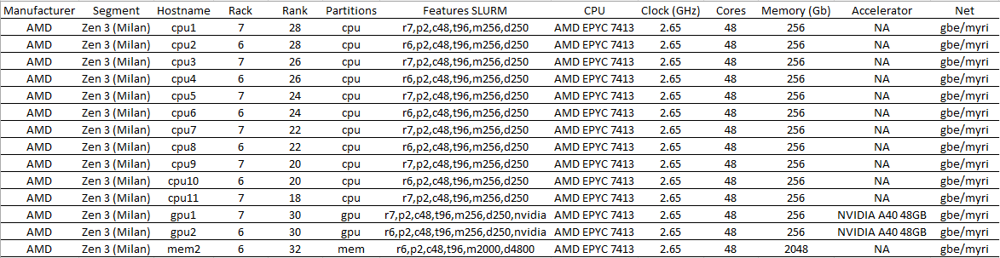

# Scientific Computing Cluster Tutorial

The Scientific Computing cluster is the 17 servers' supercomputer currently hosted at the Incubator House of HCEMM, and is managed by the [Scientific Computing ACF](https://acf.hcemm.eu/acf/scientific-computing/).

the Scientific Computing cluster is also known as the PULI supercomputer.

<p align="center">
  
</p>
<p align="center">Logo of the PULI supercomputer.</p>

In February 2025, the SC cluster came online. This tutorial will guide you through the steps to access and use it.

<br>

## Table of contents

- [1. Obtaining credentials and logging into the cluster](#1-obtaining-credentials-and-logging-into-the-cluster)
- [2. Slurm Workload Manager](#2-slurm-workload-manager)
- [3. Provision of tools and environments](#3-provision-of-tools-and-environments)
  - [3.1. Modules are the primary way that software is provisioned in the SC cluster](#31-modules-are-the-primary-way-that-software-is-provisioned-in-the-sc-cluster)
  - [3.2. Conda and pip environments](#32-conda-and-pip-environments)
  - [3.3. Apptainer provides containerized environments](#33-apptainer-provides-containerized-environments)
    - [3.3.1. Building personalized containers with `def` files](#331-building-personalized-containers-with-def-files)
- [4. Limits, quotas and partitions](#4-limits-quotas-and-partitions)

<br>

## 1. Obtaining credentials and logging into the cluster

Several steps are required until access to the SC cluster is granted.

1. Employees of HCEMM are required to fill out the [provided form](https://docs.google.com/forms/d/e/1FAIpQLSdYtCZQcaFNFLVI64hxWyigVz31GuoSrcqIz3n_kalXVCFxlA/viewform?usp=pp_url&entry.598441848=1&entry.760391226=256+Gb&entry.175258676=No&entry.1787069197=I+will+be+performing+the+following+computational+tasks:+%0A-+e.g.,+MS/MS,+microbiomes,+RNA-Seq%0A-+e.g.,+MD+modelling,+DL+model+creation+and+prediction%0A%0AI+want+to+solve+the+research+question:+%0A-+e.g.,+Identify+differentially+expressed+genes+in+cancer+samples%0A%0AI+need+the+following+specific+packages/software:+%0A-+e.g.,+Python+3.8,+TensorFlow,+R+with+DESeq2%0A%0AI+have+the+following+additional+requirements:+%0A-+e.g.,+Custom+Python+library,+specific+version+of+a+tool,+large+temporary+storage%0A%0A(please+remove+the+non-relevant+sections)&entry.1260858631=No&entry.1316491120=No) with information regarding the bioinformatic works that are intended to be run on the cluster.

2. The ACF will take notice of the response, and will create a user account for the cluster.

3. Users will get an email with the credentials. The password should be changed immediately after the first login.

4. Running `ssh username@puli.hcemm.eu` will prompt for a password, and with the right password, access is granted to the login node. From here, jobs can be submitted to the cluster.

5. After getting access to the cluster, users should create 2FA credentials, by running
```bash
ga-setup
``` 
and reading the QR code with an Authenticator app. For every login after this, the user will also be prompted for a 2FA code.

If this QR code is not working, please try with the original command: `google-authenticator`

<br>

## 2. Slurm Workload Manager

The bioinformatic jobs submitted to the SC cluster are managed by [Slurm](https://slurm.schedmd.com/documentation.html). To learn more about how you can format your jobs to be submitted to the cluster, refer to the [tutorial](../slurm_tutorial/) on Slurm.

<br>

## 3. Provision of tools and environments

### 3.1. Modules are the primary way that software is provisioned in the SC cluster

Modules are software installed system-wide. This means once a module is installed, it is available to all the users of the system. However, users can't install modules (for now).

To see which modules are available in the SC cluster, you can run
```bash
module spider                 # list all available modules
module spider bowtie2         # search for modules named bowtie2
module -r spider *spades.*    # search with regex
```

### 3.2. Conda and pip environments

To load conda into the environment, and save its configuration for startup, run 
```bash
ml miniconda3       # load the conda module into the environment
conda init          # write conda configuration into ~/.bashrc so it always loads at start
source ~/.bashrc    # load conda for the current terminal session
```
After these commands, conda will be available for use. When in a new session, these commands will create a new environment:
```bash
ml miniconda3                         # load the conda module
conda create -n my_env python=3.8     # create a new conda environment
conda activate my_env                 # activate the environment
```

<br>

### 3.3. Apptainer provides containerized environments

[Apptainer](https://apptainer.org/), the successor to Singularity, is used to provide containerized environments on the SC cluster. This is an alternative way to run analysis on the cluster, and allows to run commands with privileges that are not available on the cluster itself as, for example, `dnf/deb/apt install/update`.

To get an Apptainer container, you can follow these steps:

```bash
ml apptainer                                      # load the apptainer module
apptainer pull docker://biocontainers/bowtie2     # pull a container from DockerHub
```

This will download a `bowtie2.sif` file, which is the container itself. The following commands might be useful:

```bash
apptainer exec bowtie2.sif bowtie2 --version      # run the container with a specific command
apptainer shell --fakeroot bowtie2.sif            # open an interactive shell session inside the container, as root
exit                                              # exit the shell session
```

You can experiment running `apt update` and other administrative commands, if running as root.

#### 3.3.1. Building personalized containers with `def` files

`def` files are similar in function to `Dockerfile` files used in docker. These files provide, from a base image, a recipe for setting up the environment inside the container.

Useful recipes for building containers with Singularity/Apptainer recipes are provided by the [CSCfi](https://github.com/CSCfi/singularity-recipes). As an example, the following commands build a container for `pytorch`, using the `def` file provided in this repository:

```bash
ml apptainer              # load the apptainer module
git clone https://github.com/CSCfi/singularity-recipes      # clone the CSCfi repository
apptainer build pytorch_1.13.0_rocky.sif singularity-recipes/pytorch/pytorch_1.13.0_rocky.def           # build a container from the DEF file
apptainer exec pytorch_1.13.0_rocky.sif python -c "import torch"      # run the container and check if pytorch is available
```


<br>

## 4. Limits, quotas and partitions

By default, each user has 10 Gb on their `/home` folder and 1 Tb on their `/scratch` folder. These limits can be extended by contacting the Scientific Computing ACF.

The following table shows the information concerning the compute nodes of the SC cluster, as well as the partitions available for job submission (`cpu`, `gpu` and `highmem`):



By default, jobs are submitted to the `cpu` partition. To submit a job to the `gpu` partition, use the `--partition=gpu` flag. To submit a job to the `highmem` partition, use the `--partition=highmem` flag.

At present, these partitions are only limited by time, i.e., each job can run for a maximum of 30 days if using the `cpu` partition, and 10 days if using the `gpu` or `highmem` partitions.

