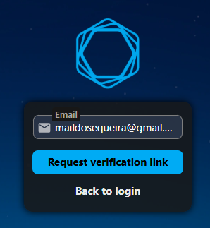
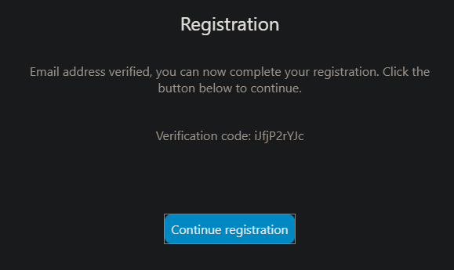
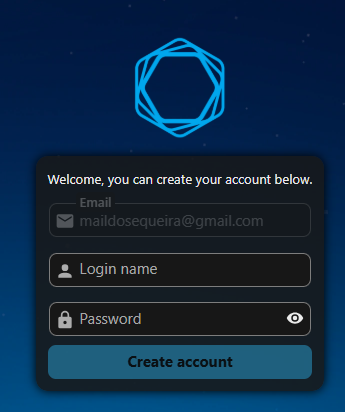
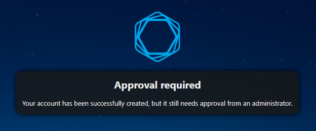
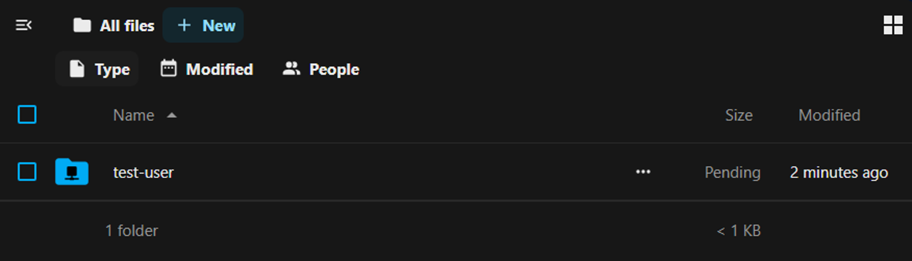
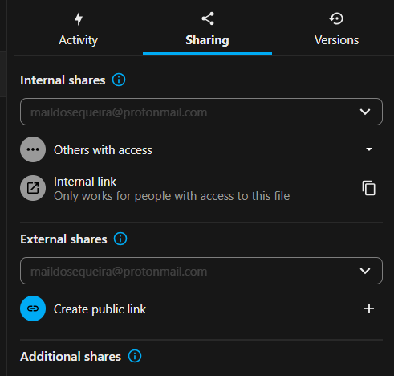

# FCBI Computational Services Tutorial

This guide introduces the two core services provided by the [Functional Cell Biology and Immunology Advanced Computational Facility (FCBI ACF)](https://acf.hcemm.eu/acf/hcemm-usz-functional-cell-biology-and-immunology/):

[NextCloud Storage Platform](#nextcloud-storage-platform): secure storage and sharing of microscopy data

[EMMA Microscope Reservation System](#emma-microscope-reservation-system): online booking platform for FCBI microscopes

## NextCloud Storage Platform

The NextCloud Storage Platform is designed to provide secure storage and sharing of microscopy data.

### Registering for FCBI's NextCloud space

<!--Before registration in NextCloud, users must fill out and submit [the form]();-->

NextCloud registration is done through the [NextCloud registration page](https://cloud.hcemm.eu/apps/registration/), following these steps:

Input your email. You will receive a verification code, which might fall on spam inbox (for me it did).

You can input the verification code you received by email, or click directly on "Continue registration". Which is simpler.

Input your desired username and password.

Administrators will receive an email to approve your account, and will do so in the next 1-2 business days. Please make sure you have already submitted the form to request access to FCBI's NextCloud space.

Once your account is approved, you can [login to NextCloud](https://cloud.hcemm.eu/login), and see your folder.

### Sharing data

Files and folders can be dropped into your NextCloud folder using the web interface. To share these files, click the three dots (...) next to the file or folder you want to share, and select "Open details". 

The sharing menu provides many options for both internal and external sharing.

## EMMA Microscope Reservation System

Coming soon.
