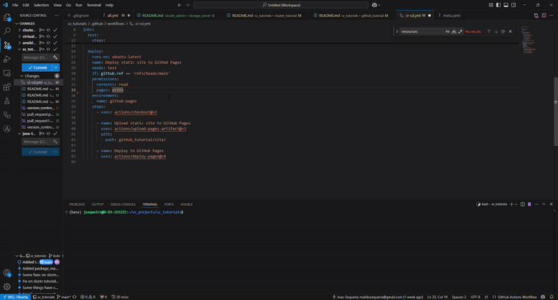
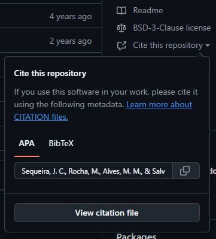

# GitHub Tutorial and Tips

Welcome! This tutorial was developed for employees developing data analyses and software in the context of Biotech, and intends to provide some tools for common bioinformatics tasks.

## 1. `README` and `.gitignore` files

### README is the first thing people see when they visit your repository

Therefore, the `README.md` file should provide a clear overview of your project, including its purpose, installation instructions, usage examples, and any other relevant information. This tutorial is a good example of a README file, and already includes many functions that make READMEs great tools for communication.

One additional tool are **badges**. Add badges to show the status of your project (e.g., build status, coverage, version, release date). Here is a badge showing the status of the CI/CD workflow in this repository (workflow explained below):


If it's "passing", it makes us happy. Following are other examples, related to releases and package versions:
```markdown
# Version of latest release in GitHub

# Date of latest release in GitHub

# Version of latest release in Bioconda

```

---

### The `.gitignore` file helps keeping your repository clean

To achieve that, the `.gitignore` file must specify the files and directories that should be excluded from version control. These files won't be uploaded to GitHub.
```sh
# Python files that show up every time you run a Python script
__pycache__/        # Python cache files
*.pyc               # Python compiled files
*.pyo               # Python optimized files   

# Data that you might want to keep private
*.csv
*.tsv
*.xlsx

# Environments that are created after running your code shouldn't be included as well
.env
*.venv/

# For the MacOS homies 🍎
.DS_Store
```

---

## 2. The Version Control Workflow

The [**version control**](https://github.com/resources/articles/software-development/what-is-version-control) system allows you to track changes in code and collaborate with others. It is implemented in Git, a distributed version control system. GitHub is a web-based platform that hosts Git repositories and provides additional features like issue tracking, pull requests, and CI/CD.

1. **Check repository status**:  
    ```bash
    git status
    ```  
    This shows changes in your working directory in a very comprehensive way.

2. **Stage changes, commit them and push the commit**:

    After making changes to your local repository, you need to inform GitHub about them, prepare a commit, and push it to the remote repository. 
    
    Once in the remote repository, the changes will be available to all collaborators, which can pull them to their local repositories. 
    
    This is the basic lifecycle of a GitHub repository.
    ```bash
    git add <file-name>     # Stage a specific file
    git add .               # Stage all changes
    git commit -m "Your commit message"   # Use a comprehensive message, might be helpful for future reference!
    git push origin main    # Push changes to the remote repository (the one hosted at GitHub)
    ```
    This commands informs Git locally about the changes you want to include in the next commit.

3. **Pull Updates from GitHub**:

    If you are collaborating with others, you may need to pull updates from the remote repository every once in a while, especially when you intend to make a new commit. This will make sure you are working with the latest version of the code.  
    ```bash
    git pull origin main
    ```

4. **Branching**:

    Branching allows you to work on different features or fixes without affecting the main codebase.  
    ```bash
    git checkout -b <branch-name>   # Create and switch to a new branch
    git checkout main                # Switch back to the main branch
    git merge <branch-name>          # Merge changes from the branch into the main branch
    git push origin <branch-name>    # Push the branch to GitHub
    ```

---

### 2.1. In an IDE

This workflow can be easily run in most IDEs. The following video shows how to do it in VS Code:



1. Files are altered;
2. File changes are staged (pressing the "+" icon);
3. A commit message is written, and "Commit and push" is pressed;
4. The commit is pushed to the remote repository.

---

### 2.2. Some useful tips

1. **To remove a file from history:** (sometimes because it contained sensitive information, such as passwords or patient data)

```bash
apt install git-filter-repo
git-filter-repo --sensitive-data-removal --invert-paths --path <file-to-remove>
```

## 3. GitHub Actions: CI/CD and GitHub pages

[GitHub Actions](https://github.com/features/actions) (GHA) allows you to automate workflows like testing and deployment.

**CI/CD** stands for Continuous Integration and Continuous Deployment. It is a software development practice that allows you to automate the process of testing and deploying code changes. This includes keep your software up to date in package repositories, such as PyPI, CRAN, Bioconductor, and DockerHub. CI/CD can be implemented with GitHub Actions, as explained next.

This repo includes a very basic [CI/CD pipeline](https://github.com/HCEMM/sc_tutorials/blob/main/.github/workflows/ci-cd.yml), which tests a simple Python function, and displays its output in a static site hosted with [GitHub pages](https://pages.github.com/) (GHP). 

```yaml
name: CI + GitHub Pages CD      # the name of the action

on:
  push:                         # run every time someone pushes code
    branches: [main]            # but only when code was pushed to the main branch
  pull_request:                 # also run every time someone makes a pull request to any branch

jobs:
  test:                         # id of this job
    runs-on: ubuntu-latest      # only need to test it on the latest Ubuntu version - multiple OSes and OS versions could be specified
    name: Run Python Tests      # name of this job
    steps:
      - uses: actions/checkout@v3       # checkout/get the code of the repository

      - name: Set up Python
        uses: actions/setup-python@v4       # setup a python environment
        with:
          python-version: 3.11

      - name: Install pytest
        run: pip install pytest             # install pytest in the python environment

      - name: Run tests
        run: pytest github_tutorial/tests/      # point pytest to the tests folder

  deploy:
    runs-on: ubuntu-latest
    name: Deploy static site to GitHub Pages
    needs: test                                 # only runs after "test" finishes without errors
    if: github.ref == 'refs/heads/main'         # only runs if the branch is "main" - if "test" runs for other branches, this won't run
    permissions:                                # give specific permissions to GHA
      contents: read                            # read access to the repository
      pages: write                              # give write access to GHP - essential for deploying
      id-token: write                           # allow generating an OIDC token for authentication with GHP - GHP demands
    steps:
      - uses: actions/checkout@v3               # same as before - checkout the code

      - name: Upload static site to GitHub Pages
        uses: actions/upload-pages-artifact@v3
        with:
          path: github_tutorial/site/           # point to the folder where the static site is

      - name: Deploy to GitHub Pages
        uses: actions/deploy-pages@v4
```

Results from this workflow can be seen in the [`Actions`](https://github.com/HCEMM/sc_tutorials/actions) tab of this repository, and on the [GitHub pages deployment](https://hcemm.github.io/sc_tutorials).

---

## 4. Licensing and Citation  

### Adding a License allows your work to be used by others while protecting your rights.

In the absence of a license, code and software [cannot be used](https://choosealicense.com/no-permission/). So this should be avoided, less you want your work to be used by you alone.

A License can be chosen at the time of creating a repository, or added later. [choosealicense.com](https://choosealicense.com/) is a great place to start informing yourself.

* Typically, the [MIT license](https://choosealicense.com/licenses/mit/) is a good choice for most projects, as it allows others to use, modify, and distribute your code with minimal restrictions. This means your open-source work can be used in both open-source and proprietary projects.

* If you want to force work built upon your own to also be open source, you can use a [GNU General Public License (GPL)](https://choosealicense.com/licenses/gpl-3.0/) or a [Apache License 2.0](https://choosealicense.com/licenses/apache-2.0/). These are permissive licenses that allow others to use your code but require them to include the same license in their own projects.

Once you have a license, add the `LICENSE` file to your repository. This file should contain the full text of the license you chose, and GitHub will automatically detect and parse it.


This repo uses a MIT license.

### A reference connects your work to your publications

Adding a `CITATION.cff` file to your repository allows you to provide a standardized way for others to cite your work. [Here](https://github.com/iquasere/UPIMAPI/blob/master/CITATION.cff) is a good example.



Once the `CITATION.cff` file is added, an option will show up to "Cite this repository".
