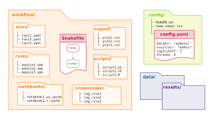

# Workflow Manager Tutorial — Snakemake exercise

This tutorial walks through a compact Snakemake workflow that:
- creates a tiny reference database,
- simulates short-read FASTQ samples,
- builds an index, aligns reads, and produces cleaned BAMs,
- computes alignment quality metrics,
- produces gene-level TSV quantifications (featureCounts),
- performs a simple differential expression (DE) analysis with DESeq2,
- demonstrates a few "crazy" Snakemake features (checkpoints, dynamic files, grouping, per-rule conda).

Prerequisites
- Snakemake >= 6.x
- conda or mamba available (or Docker/Singularity if you adapt env usage)
- standard bioinformatics tools installed via Conda environments used in rules:
    - bowtie2, samtools, subread (featureCounts), fastqc, multiqc, python3, R with DESeq2

Repository layout (what this tutorial will create)
- Snakefile
- config.yaml
- envs/ (conda env YAMLs)
- scripts/
    - make_reads.py
    - summarize_metrics.py
- scripts/de_deseq2.R
- README.md (this file autogenerated into your working dir)

Quick start
1. Copy the files below into the repo root.
2. Run:
     - snakemake --use-conda --cores 4
     - or test locally with snakemake -n to dry-run.

Explanation of "crazy" Snakemake features used
- checkpoint build_bowtie2_index: demonstrates building an index and using its dynamic path for downstream alignment (get_index_dir).
- temp() on BAM outputs: keeps intermediate files ephemeral if you want to save disk space.
- per-rule conda environments keep tools isolated.
- expand + wildcard combos to create multi-sample rules and aggregate steps (multiqc, DE).

What you will get after running
- qc/multiqc_report.html — combined QC summary
- qc/*_alignment_metrics.txt — basic mapping rates per sample
- counts/*.tsv — TSV with gene -> counts per sample
- de/deseq2_results.tsv — DESeq2 output with log2FoldChange and p-values

Notes and extensions
- Replace bowtie2 + featureCounts with pseudoaligners (Salmon/Kallisto) if you prefer transcript-level quantification. Adjust rules accordingly.
- Add rule grouping or resources to schedule heavy alignment jobs on HPC.
- For real datasets, create a proper GTF for featureCounts and use paired-end FASTQ.
- Add MultiQC modules or custom Rmarkdown reports for better output.

Run example
- snakemake --use-conda --cores 4
- For debugging step-by-step: snakemake --use-conda align --cores 1

This compact tutorial provides a complete, runnable Snakemake pipeline for an end-to-end read alignment → quantification → DE analysis exercise. Adapt the small reference and parameters to your teaching dataset as needed.
